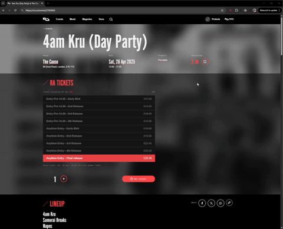

<div style="text-align: center;">
    
</div>

# RA Set Finder

`RA Set Finder` is a chrome extension that enhances [Resident Advisor](https://ra.co/) event pages by scraping DJ lineups and surfacing related DJ sets from YouTube.

*I use it to discover artists I have never heard of before.*

<div style="text-align: center;">
  
</div>

# Contents

- [Why?](#why)
- [Features](#features)
- [Setup Locally](#setup-locally)
- [Technical Stack](#technical-stack)
- [Known Issues](#known-issues)
- [License](#license)

## Why?

As a music enthusiast and developer, I wanted a tool to easily surface DJ sets from artists I discover on Resident Advisor. 
This project helped me explore real-world scraping, Chrome extension APIs, and API proxying while focusing on user experience.

## Features

- Extracts DJ names directly from RA event pages
- Fetches high-quality DJ set links via YouTube Data API
- Caches results locally using `chrome.storage`
- Built with responsiveness and fast load in mind

## Setup Locally

> Project is available for local use with limitations, not published to chrome web store.

#### 1. Clone and install dependencies

```bash
  # Clone and install dependencies
git clone https://github.com/BrandonEastwell/RA-Set-Finder.git
cd RA-Set-Finder
npm install
```

#### 2. Build the project

```bash
  # Build
npm run build
```

#### 3. Open Chrome [`chrome extensions`](chrome://extensions)

#### 4. Enable Developer Mode

#### 5. Click `Load unpacked` and select the `/dist` build folder

#### 6. **Done.**

## Technical Stack

- **Frontend**: React + TypeScript + Tailwind CSS
- **Extension Platform**: Chrome Extension (Manifest V3)
- **Data Fetching**: YouTube Data API (server-proxied)
- **State/Cache**: chrome.storage
- **Testing**: Vitest + React Testing Library + Jest (backend)
- **Backend Proxy**: Node.js + Express.js (to protect API keys)

## Known Issues

- **Youtube API Limitations**: Standard daily quota of 10,000 when each request costs 100.

## License

This project is licensed under the MIT License.

You’re welcome to clone, modify, and run the extension locally.  
It is not currently published to the Chrome Web Store.